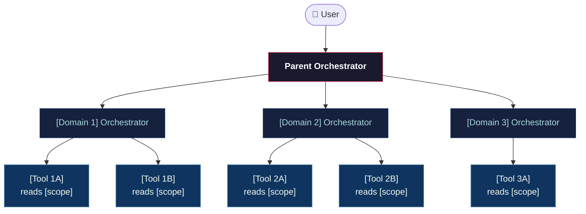
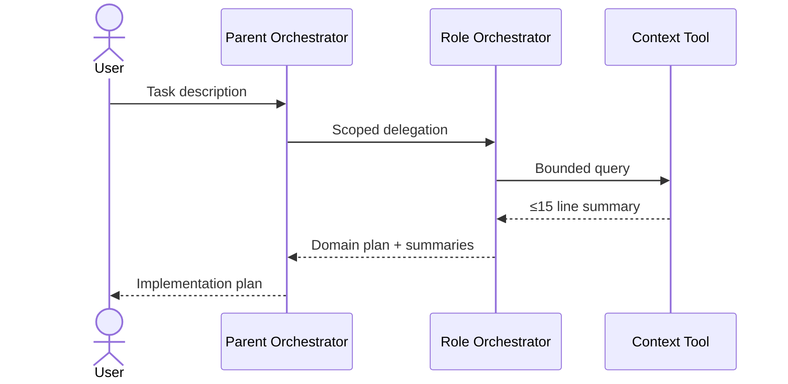

# Output Template: Architecture Diagram

Use this template when generating the architecture-diagram.md for a project.
The Mermaid diagram renders in GitHub, Obsidian, Notion, and most modern markdown viewers.

---

```markdown
# Architecture Diagram — [Project Name]

## Agent Hierarchy



---

## Information Flow



---

## Agent Summary

| Agent | Type | Reads | Returns | Token Budget |
|-------|------|-------|---------|-------------|
| Parent Orchestrator | Parent Orchestrator | Nothing | Implementation plan | 2000 |
| [Domain] Orchestrator | Role Orchestrator | Nothing | Domain plan | 1000 |
| [Tool Name] | Context Tool | [scope] | [output contract, ≤15 lines] | 300 |

---

## Scope Map

Which directories each context tool is allowed to read:

| Tool | Allowed Scope |
|------|--------------|
| [tool name] | [directory/file pattern] |
| [tool name] | [directory/file pattern] |

Everything outside a tool's allowed scope is invisible to it.
```
